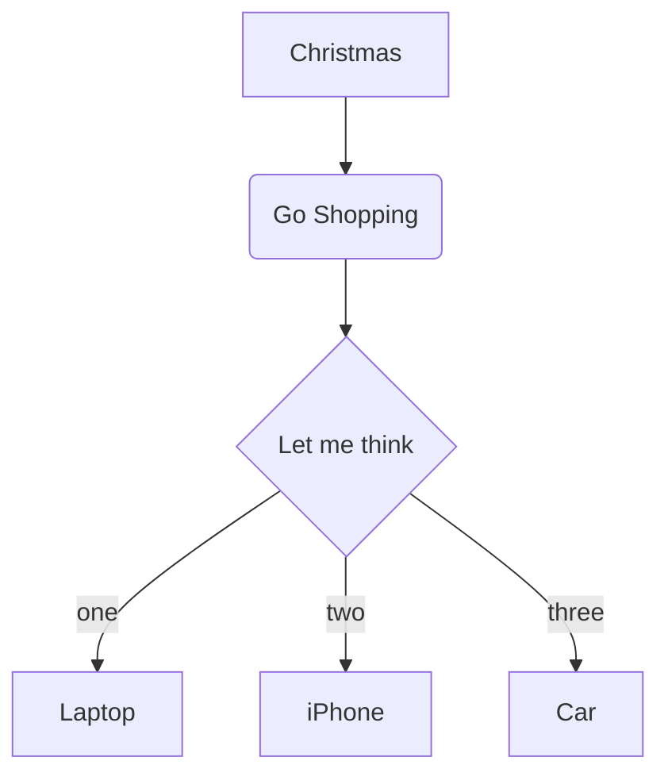
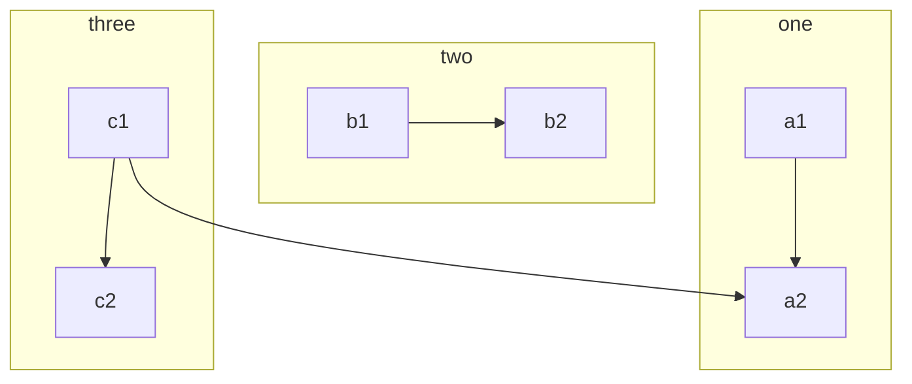

# 标题
## 二级标题

# 列表
## 无序列表 - 或者 有序列表 1. 2.
- 文本
- 文本

1. 文本1
2. 文本2

# 引用
## > 引文
>欢迎关注“博客”

# 粗体和斜体
## *斜体* **粗体**

- [x] 已完成项目1
- [x] 已完成事项
- [ ] 代办事项
- [ ] 代办项目2
- [ ] 代办项目3

# 表格
## 使用 | 来分隔不同的单元格，使用 - 来分隔表头和其他行：
- :--- 代表左对齐
- :--: 代表居中对齐
- ---: 代表右对齐

| Tables        | Are           | Cool  |
| ------------- |:-------------:| -----:|
| col 3 is      | right-aligned | $1600 |
| col 2 is      | centered      |   $12 |
| zebra stripes | are neat      |    $1 |

# 流程图
```seq
title: 时序图例子
A->B: 实线实箭头
B-->C: 虚线实箭头
C->>C: 实线虚箭头
note right of C: 自通知
note over B,C:横跨通知
C->A:长通知
note left of A:左通知
```






TB 从上到下
BT 从下到上
RL 从右到左
LR 从左到右
TD 同TB


# 高亮代码块```[语言类型]
如
```python
写在这些之间的就是代码
import os
```
# 流程图
```flow
st=>start: 开始
```

```flow
st=>start: 用户登陆
op=>operation: 登陆操作
cond=>condition: 登陆成功 Yes or No?
e=>end: 进入后台

st->op->cond
cond(yes)->e
cond(no)->op
```


## MdEditor的功能列表演示

# 标题H1

## 标题H2

### 标题H3

#### 标题H4

##### 标题H5

###### 标题H5

### 字符效果和横线等
----

~~删除线~~ <s>删除线（开启识别HTML标签时）</s>

*斜体字*      _斜体字_

**粗体**  __粗体__

***粗斜体*** ___粗斜体___

上标：X<sub>2</sub>，下标：O<sup>2</sup>

**缩写(同HTML的abbr标签)**
> 即更长的单词或短语的缩写形式，前提是开启识别HTML标签时，已默认开启

The <abbr title="Hyper Text Markup Language">HTML</abbr> specification is maintained by the <abbr title="World Wide Web Consortium">W3C</abbr>.
### 引用 Blockquotes

> 引用文本 Blockquotes

引用的行内混合 Blockquotes

> 引用：如果想要插入空白换行`即<br />标签`，在插入处先键入两个以上的空格然后回车即可，[普通链接](https://www.mdeditor.com/)。

### 锚点与链接 Links
[普通链接](https://www.mdeditor.com/)
[普通链接带标题](https://www.mdeditor.com/ "普通链接带标题")
直接链接：<https://www.mdeditor.com>
[锚点链接][anchor-id]
[anchor-id]: https://www.mdeditor.com/
[mailto:test.test@gmail.com](mailto:test.test@gmail.com)
GFM a-tail link @pandao
邮箱地址自动链接 test.test@gmail.com  www@vip.qq.com
> @pandao

### 多语言代码高亮 Codes

#### 行内代码 Inline code


执行命令：`npm install marked`

#### 缩进风格

即缩进四个空格，也做为实现类似 `<pre>` 预格式化文本 ( Preformatted Text ) 的功能。

    <?php
        echo "Hello world!";
    ?>
预格式化文本：

    | First Header  | Second Header |
    | ------------- | ------------- |
    | Content Cell  | Content Cell  |
    | Content Cell  | Content Cell  |

#### JS代码
```javascript
function test() {
    console.log("Hello world!");
}
```

#### HTML 代码 HTML codes
```html
<!DOCTYPE html>
<html>
    <head>
        <mate charest="utf-8" />
        <meta name="keywords" content="Editor.md, Markdown, Editor" />
        <title>Hello world!</title>
        <style type="text/css">
            body{font-size:14px;color:#444;font-family: "Microsoft Yahei", Tahoma, "Hiragino Sans GB", Arial;background:#fff;}
            ul{list-style: none;}
            img{border:none;vertical-align: middle;}
        </style>
    </head>
    <body>
        <h1 class="text-xxl">Hello world!</h1>
        <p class="text-green">Plain text</p>
    </body>
</html>
```
### 图片 Images

图片加链接 (Image + Link)：


[](https://www.mdeditor.com/images/logos/markdown.png "markdown")

> Follow your heart.

----
### 列表 Lists

#### 无序列表（减号）Unordered Lists (-)

- 列表一
- 列表二
- 列表三

#### 无序列表（星号）Unordered Lists (*)

* 列表一
* 列表二
* 列表三

#### 无序列表（加号和嵌套）Unordered Lists (+)
+ 列表一
+ 列表二
    + 列表二-1
    + 列表二-2
    + 列表二-3
+ 列表三
    * 列表一
    * 列表二
    * 列表三

#### 有序列表 Ordered Lists (-)

1. 第一行
2. 第二行
3. 第三行

#### GFM task list

- [x] GFM task list 1
- [x] GFM task list 2
- [ ] GFM task list 3
    - [ ] GFM task list 3-1
    - [ ] GFM task list 3-2
    - [ ] GFM task list 3-3
- [ ] GFM task list 4
    - [ ] GFM task list 4-1
    - [ ] GFM task list 4-2

----

### 绘制表格 Tables

| 项目        | 价格   |  数量  |
| --------   | -----:  | :----:  |
| 计算机      | $1600   |   5     |
| 手机        |   $12   |   12   |
| 管线        |    $1    |  234  |

First Header  | Second Header
------------- | -------------
Content Cell  | Content Cell
Content Cell  | Content Cell

| First Header  | Second Header |
| ------------- | ------------- |
| Content Cell  | Content Cell  |
| Content Cell  | Content Cell  |

| Function name | Description                    |
| ------------- | ------------------------------ |
| `help()`      | Display the help window.       |
| `destroy()`   | **Destroy your computer!**     |

| Left-Aligned  | Center Aligned  | Right Aligned |
| :------------ |:---------------:| -----:|
| col 3 is      | some wordy text | $1600 |
| col 2 is      | centered        |   $12 |
| zebra stripes | are neat        |    $1 |

| Item      | Value |
| --------- | -----:|
| Computer  | $1600 |
| Phone     |   $12 |
| Pipe      |    $1 |

----

#### 特殊符号 HTML Entities Codes

&copy; &  &uml; &trade; &iexcl; &pound;
&amp; &lt; &gt; &yen; &euro; &reg; &plusmn; &para; &sect; &brvbar; &macr; &laquo; &middot;

X&sup2; Y&sup3; &frac34; &frac14;  &times;  &divide;   &raquo;

18&ordm;C  &quot;  &apos;

[========]

### Emoji表情 :smiley:

> Blockquotes :star:

#### GFM task lists & Emoji & fontAwesome icon emoji & editormd logo emoji :editormd-logo-5x:

- [x] :smiley: @mentions, :smiley: #refs, [links](), **formatting**, and <del>tags</del> supported :editormd-logo:;
- [x] list syntax required (any unordered or ordered list supported) :editormd-logo-3x:;
- [x] [ ] :smiley: this is a complete item :smiley:;
- [ ] []this is an incomplete item [test link](#) :fa-star: @pandao;
- [ ] [ ]this is an incomplete item :fa-star: :fa-gear:;
    - [ ] :smiley: this is an incomplete item [test link](#) :fa-star: :fa-gear:;
    - [ ] :smiley: this is  :fa-star: :fa-gear: an incomplete item [test link](#);

#### 反斜杠 Escape

\*literal asterisks\*

[========]
### 科学公式 TeX(KaTeX)

$$E=mc^2$$

行内的公式$$E=mc^2$$行内的公式，行内的$$E=mc^2$$公式。

$$x > y$$

$$\(\sqrt{3x-1}+(1+x)^2\)$$

$$\sin(\alpha)^{\theta}=\sum_{i=0}^{n}(x^i + \cos(f))$$

多行公式：

```math
\displaystyle
\left( \sum\_{k=1}^n a\_k b\_k \right)^2
\leq
\left( \sum\_{k=1}^n a\_k^2 \right)
\left( \sum\_{k=1}^n b\_k^2 \right)
```
```katex
\displaystyle
    \frac{1}{
        \Bigl(\sqrt{\phi \sqrt{5}}-\phi\Bigr) e^{
        \frac25 \pi}} = 1+\frac{e^{-2\pi}} {1+\frac{e^{-4\pi}} {
        1+\frac{e^{-6\pi}}
        {1+\frac{e^{-8\pi}}
         {1+\cdots} }
        }
    }
```
```latex
f(x) = \int_{-\infty}^\infty
    \hat f(\xi)\,e^{2 \pi i \xi x}
    \,d\xi
```
### 分页符 Page break

> Print Test: Ctrl + P

[========]

### 绘制流程图 Flowchart

```flow
st=>start: 用户登陆
op=>operation: 登陆操作
cond=>condition: 登陆成功 Yes or No?
e=>end: 进入后台

st->op->cond
cond(yes)->e
cond(no)->op
```
[========]

### 绘制序列图 Sequence Diagram

```seq
Andrew->China: Says Hello
Note right of China: China thinks\nabout it
China-->Andrew: How are you?
Andrew->>China: I am good thanks!
```
### End